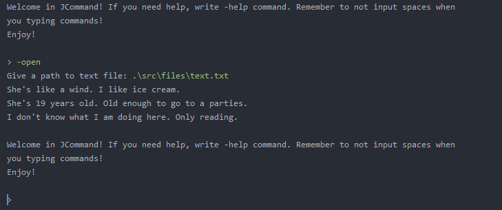

# JCommand
Terminal-like application. For educational purposes. Made with Java JDK 12 & 13 features like text blocks and switch statements. Additional things will be added soon with project's progress.

# Table of Contents
* [General info](#general-info)
* [Technologies](#technologies)
* [Setup](#setup)
* [Changelog](#changelog)

## General info
This project is made for checking current abilities of programming in Java. Also, project is being developed with new versions of Java - 12 and 13 with features like new version of switch statement (this project uses switch from JDK 12) and text blocks in String (JDK 13). It's mostly about using Scanner input system and doing some tasks like opening files or checking version of the terminal. Some other features will be added soon.

## Technologies
Project is created with:
* Java JDK 15 (with features of JDK 12 & 13).

## Setup
To run this project, download it and open with IDE (for example IntelliJ IDEA by JetBrains). Your IDE should find the main class (it's ony one). If not, find manually. It's under jcommand package.

An example of running program:

## Changelog

V1.1
* Added -genfuntxt, -gft command into list. This command generates funny text in Polish language.
* Added short versions of implemented commands.

V1.0
* Added -exit, -help, -open, --version commands.
